<h1 align="center">Hola 👋, Soy Fabián Lizama</h1>
<h3 align="center">Estudiante de Ingeniería Civil Informática en la Universidad de Santiago de Chile con experiencia laboral en TI, desarrollo web y actualmente DevOps.</h3>
<h4 align="center">Además actual ayudante de las asignaturas de Paradigmas de Programación, DevSecOps y Modelos y Simulación.</h4>

  
  

  

  
  

